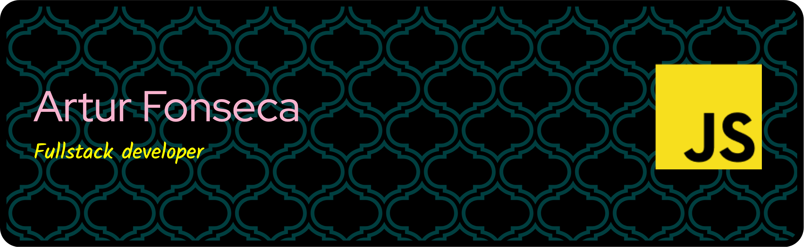

---

## ✨ Skills

| Category | Key Technologies & Experience |
| :--- | :--- |
| **Backend & Core** | **Laravel (Ecosystem)**, PHP, **Redis**, WebSockets, Queues/Jobs, Relational Databases (PostgreSQL) |
| **Frontend** | **Vue.js**, **React**, Tailwind CSS, Bootstrap, JQuery, Blade |
| **DevOps & Tools** | Docker, Docker Compose, CI Tools |
| **Languages** | JavaScript, PHP |

---

## ⚔️ Experience

### Professional
- Currently a software developer, focusing on Laravel, Vue.js, React and PostgreSQL.

- **TypeBot and Live Chat**: Implemented a live chat with multi tenant support with integrations with Whatsapp API and typebot flows.
  
- **Healthcare Management (E-saude):** Key contributor to healthcare system, developing features that streamline main hospital activities and management across the country. (NOW)

---

## 📚 Goals
- Expand my knowledge in web technologies.
- Learn more about real-time systems, like applications for games.
- Become a highly skilled and more valuable full-stack developer

---

## 🎮 Fun Facts
- I'm developing an online chess game as a hobby.
- I love learning by doing, whether it's building APIs, web systems, or refining programming logic.
  
---

## ☑️ Let's Connect?
- **LinkedIn**: [https://www.linkedin.com/in/arturf-fonseca/](https://www.linkedin.com/in/arturf-fonseca/)
- **Email**: [sgsartur@hotmail.com](sgsartur@hotmail.com)

---

Thank you for visiting my profile! If you find any project interesting or have suggestions, feel free to open an issue or reach out to chat. 🚀
